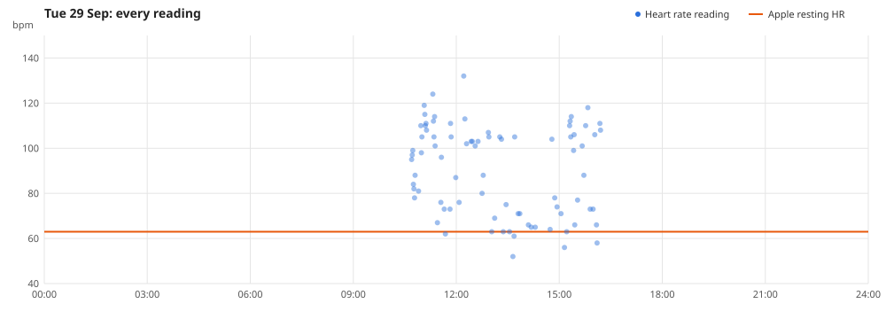
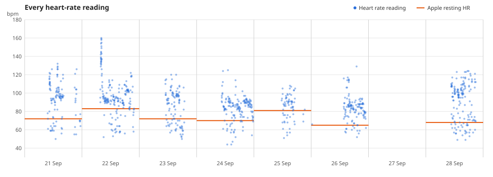
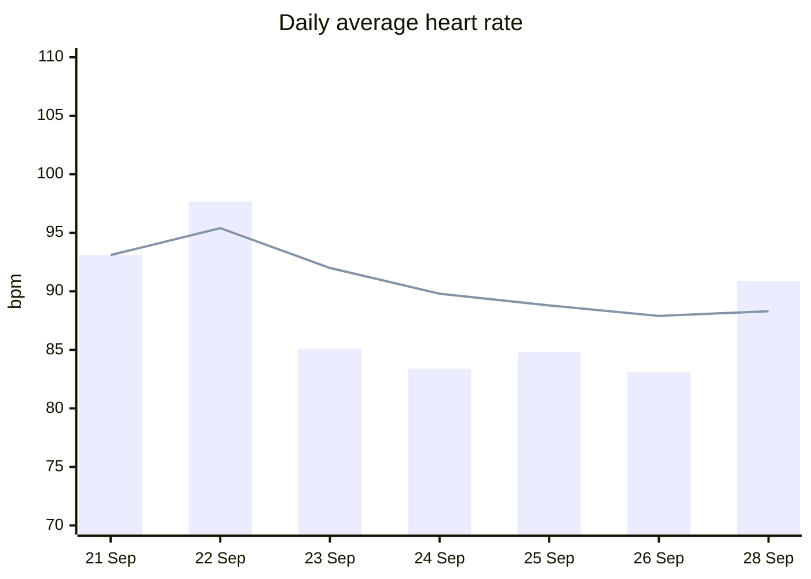
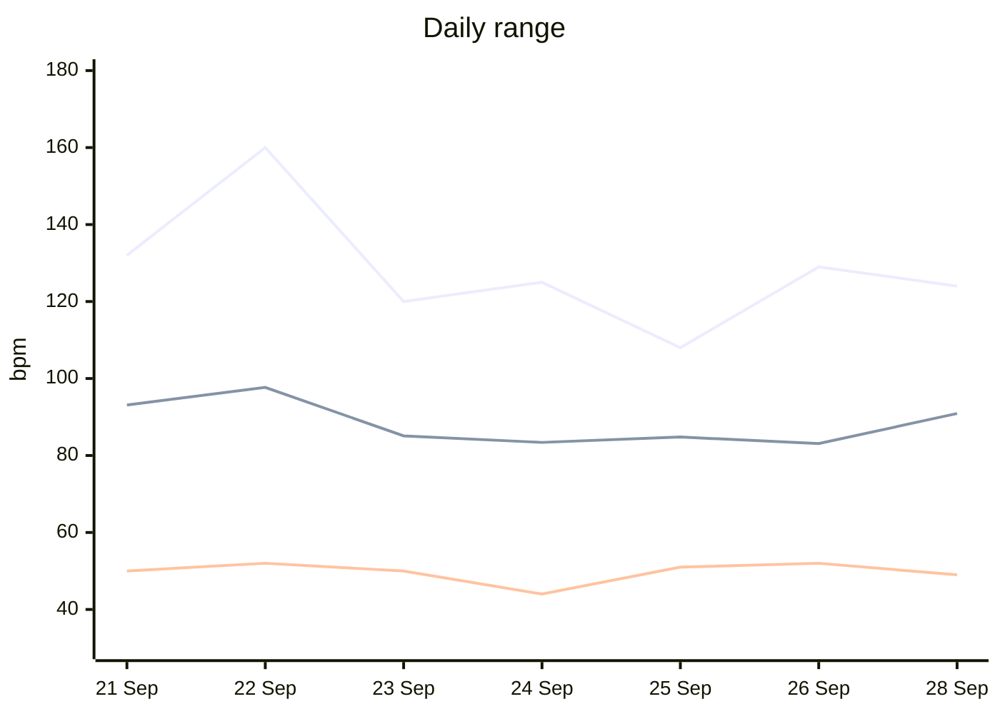

# Heart rate report

**Data from 21 Sep 2026 to 28 Sep 2026, 20:53** · 7 days · 896 readings · heart rate from the `Heart Rate [Min] (bpm)` column.

## Latest day: Monday 28 September

| | This day | Your usual (average of previous days) | Compared with usual |
|---|---|---|---|
| Average HR | 90.9 | 87.9 | ▲ 3.0 higher |
| Resting HR | 68 | 73.8 | ▼ 5.8 lower |
| Lowest reading | 49 | 49.8 | ▼ 0.8 lower |
| Highest reading | 124 | 129 | ▼ 5 lower |
| Variability (std dev) | 20.4 | 16.9 | ▲ 3.5 higher |

Resting HR for this day is Apple's own resting reading. 152 readings. [Full day report](2026-09-28.md)

## This week vs last week

| | This week (Mon 21 Sep – Mon 28 Sep) | Previous week | Change |
|---|---|---|---|
| Average HR | 88.3 | — | — |
| Resting HR | 73 | — | — |
| Lowest reading | 44 | — | — |
| Highest reading | 160 | — | — |
| Variability (std dev) | 17.4 | — | — |

_Previous week has 0 of 7 days so far; the comparison is complete after 7 more day(s) of data._

## Trends

**Every reading**: each dot is one heart-rate sample at its real time; gaps are when the watch wasn't recording. The orange line is Apple's resting HR for that day.

**Daily average** (bars) and **7-day rolling average** (line).

**Daily range**: highest reading (top line), average (middle), lowest reading (bottom).

**Resting heart rate.** A lower resting HR over time usually goes with better fitness and recovery; short spikes often follow poor sleep, stress, illness or alcohol.

## Highlights

| | Day | Value |
|---|---|---|
| Lowest resting HR | [Sat 26 Sep](2026-09-26.md) | 65 bpm |
| Highest resting HR | [Tue 22 Sep](2026-09-22.md) | 83 bpm |
| Calmest day (lowest average) | [Sat 26 Sep](2026-09-26.md) | 83.1 bpm |
| Busiest day (highest average) | [Tue 22 Sep](2026-09-22.md) | 97.7 bpm |
| Highest single reading | [Tue 22 Sep](2026-09-22.md) | 160 bpm |
| Most variable day | [Tue 22 Sep](2026-09-22.md) | 22.7 |

## Every day

Compared with your overall average of **88.3 bpm** (resting **73 bpm**). Newest first.

| Day | Avg | vs overall | Resting | vs overall | Min | Max | Std dev | Readings |
|---|---|---|---|---|---|---|---|---|
| [Mon 28 Sep](2026-09-28.md) | 90.9 | ▲ 2.6 higher | 68 | ▼ 5 lower | 49 | 124 | 20.4 | 152 |
| [Sat 26 Sep](2026-09-26.md) | 83.1 | ▼ 5.2 lower | 65 | ▼ 8 lower | 52 | 129 | 13.5 | 124 |
| [Fri 25 Sep](2026-09-25.md) | 84.8 | ▼ 3.5 lower | 81 | ▲ 8 higher | 51 | 108 | 13.5 | 68 |
| [Thu 24 Sep](2026-09-24.md) | 83.4 | ▼ 4.9 lower | 70 | ▼ 3 lower | 44 | 125 | 13.3 | 154 |
| [Wed 23 Sep](2026-09-23.md) | 85.1 | ▼ 3.2 lower | 72 | ▼ 1 lower | 50 | 120 | 17.9 | 101 |
| [Tue 22 Sep](2026-09-22.md) | 97.7 | ▲ 9.4 higher | 83 | ▲ 10 higher | 52 | 160 | 22.7 | 182 |
| [Mon 21 Sep](2026-09-21.md) | 93.1 | ▲ 4.8 higher | 72 | ▼ 1 lower | 50 | 132 | 20.2 | 115 |

`~` = resting HR estimated (no Apple reading that day). 

What the numbers mean

- **Average HR**: mean of all readings that day.
- **Resting HR**: Apple's once-a-day resting value; if missing, the mean of that day's lowest 10% of readings.
- **Lowest / highest reading**: extremes across the day's readings.
- **Variability (std dev)**: how much HR moved around during the day; higher usually means more activity.
- **7-day rolling average**: average of the last 7 days' averages; smooths out single-day noise.
- **Readings**: Apple Watch samples HR every few minutes at rest, more often when active, so more readings usually means more wear time or activity.

Not medical advice.

Raw numbers: [daily_stats.csv](daily_stats.csv)
